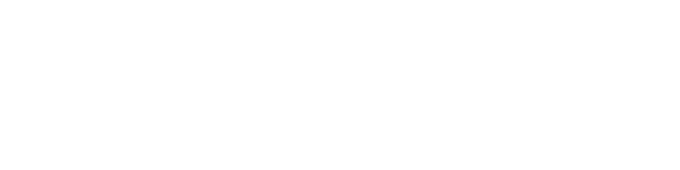
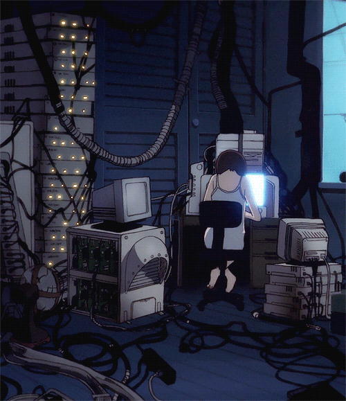

# 🌐 m-zaki-237

<div align="center">
  <picture>
    
  </picture>
</div>

<br />

<div align="center">
  <picture>
    
  </picture>
</div>

<br />

<div align="center">
  <a href="https://github.com/m-zaki-237" target="_blank" rel="noopener noreferrer">
    
  </a>
  &nbsp;&nbsp;&nbsp;&nbsp;
  <a href="https://www.linkedin.com/in/muhammad-zakria-7a8402330/" target="_blank" rel="noopener noreferrer">
    
  </a>
</div>

<br />

## ─── 📡 BIOLOGICAL NODE PARAMETERS (ABOUT ME) ───

I am a **Computer Science** undergraduate at **COMSATS University Islamabad, Attock Campus** (GPA: 3.77), and a **MERN Stack Developer** with real-world experience building and shipping full-stack web applications.

*   🔭 **Current Project:** Building **Nexus** — a full-stack startup networking platform connecting entrepreneurs and investors, with real-time messaging via Socket.IO.
*   💼 **Current Role:** Software Development Intern @ **DevelopersHub Corporation** — building and deploying production MERN applications.
*   🏆 **Achievement:** Ranked **3rd** in Saylani Mass IT Training's competitive 10-month MERN Stack Development Bootcamp.
*   🎯 **Target:** Build a production-ready SaaS product during university and scale it nationally, then internationally.

---

### 🧠 CORE SYSTEM SPECS (TECH STACK)

*   **Languages:** `JavaScript`, `TypeScript`, `Java`, `Python`, `HTML`, `CSS`
*   **Frontend:** `React.js`, `Redux Toolkit`, `Tailwind CSS`, `Zustand`, `Framer Motion`
*   **Backend:** `Node.js`, `Express.js`, `REST APIs`, `Socket.IO`
*   **Database:** `MongoDB`, `Mongoose`, `PostgreSQL`
*   **Tools:** `Git`, `GitHub`, `VS Code`, `Vercel`, `Render`, `MongoDB Atlas`

---

### ⚙️ SYSTEM STATE (`/dev/status`)

<!--SYSTEM_STATE:START-->
```
m-zaki-237@node
-------------------
OS:       MERN Stack Dev
Host:     COMSATS University Islamabad, Attock Campus
Kernel:   BS Computer Science, 3rd Semester (GPA: 3.77)
Uptime:   Software Dev Intern @ DevelopersHub Corporation
Shell:    JavaScript / TypeScript
Project:  Nexus — Full-Stack Startup Networking Platform (React/TS + Node.js + Socket.IO)
Research: System Design & Scalable SaaS Architecture
Target:   Ship production SaaS product during university
```
<!--SYSTEM_STATE:END-->

---

### 💡 STAGED PROTOCOLS (IDEAS & BACKLOG)

<!--STAGED_IDEAS:START-->
*   Scale Nexus with deals flow, investor matching, and startup analytics
*   Build and launch a production SaaS product — target national then international scale
*   Deepen expertise in system design and distributed systems
<!--STAGED_IDEAS:END-->

---

### 🎙️ Transmission Received

<table width="100%" border="0" cellspacing="0" cellpadding="10" style="border: none;">
  <tr>
    <td width="30%" align="center" valign="middle" style="border: none;">
      
    </td>
    <td width="70%" valign="middle" style="border: none; font-family: monospace; line-height: 1.6;">
      <p><i>"No matter where you are, everyone is always connected. Even if you die, your consciousness remains in the Wired."</i><br>
      <strong>— Serial Experiments Lain</strong></p>
      <br>
      <p><i>"This is the choice of Steins;Gate. The world line can be rewritten. El Psy Kongroo."</i><br>
      <strong>— Okabe Rintaro (Steins;Gate)</strong></p>
    </td>
  </tr>
</table>

---

<div align="center">
  <p align="center" style="font-family: monospace; color: #5d4370; font-size: 11px;">
    WIRED PROTOCOL INITIATED // IP STATE: SECURE // CLOSE THE WORLD, OPEN THE NEXT.
  </p>
</div>
