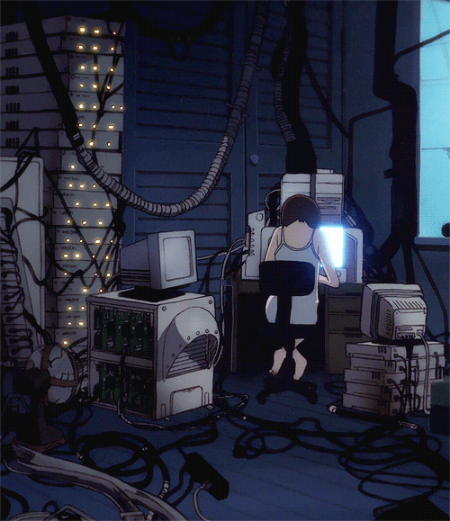

### 🧠 CORE SYSTEM SPECS

*   **Languages:** `JavaScript`, `TypeScript`, `Java`, `Python`, `HTML`, `CSS`
*   **Frontend:** `React.js`, `Redux Toolkit`, `Tailwind CSS`, `Zustand`, `Framer Motion`
*   **Backend:** `Node.js`, `Express.js`, `REST APIs`, `Socket.IO`
*   **Database:** `MongoDB`, `Mongoose`, `PostgreSQL`
*   **Tools:** `Git`, `GitHub`, `VS Code`, `Vercel`, `Render`, `MongoDB Atlas`

---

### ⚙️ SYSTEM STATE (`/dev/status`)

<!--SYSTEM_STATE:START-->
```
m-zaki-237@node
-------------------
OS:       Fedora
Host:     Zaki
Kernel:   BS Computer Science
Uptime:   Since Birth
Shell:    JavaScript / TypeScript
Research: System Design & Scalable SaaS Architecture
Target:   Ship production SaaS product during university
```
<!--SYSTEM_STATE:END-->

---

### 🎙️ Transmission Received

<table width="100%" border="0" cellspacing="0" cellpadding="10" style="border: none;">
  <tr>
    <td width="30%" align="center" valign="middle" style="border: none;">
      
    </td>
    <td width="70%" valign="middle" style="border: none; font-family: monospace; line-height: 1.6;">
      <p><i>"No matter where you are, everyone is always connected. Even if you die, your consciousness remains in the Wired."</i><br>
      <strong>— Serial Experiments Lain</strong></p>
      <br>
      <p><i>"This is the choice of Steins;Gate. The world line can be rewritten. El Psy Kongroo."</i><br>
      <strong>— Okabe Rintaro (Steins;Gate)</strong></p>
    </td>
  </tr>
</table>

---

<div align="center">
  <p align="center" style="font-family: monospace; color: #5d4370; font-size: 11px;">
    WIRED PROTOCOL INITIATED // IP STATE: SECURE // CLOSE THE WORLD, OPEN THE NEXT.
  </p>
</div>
